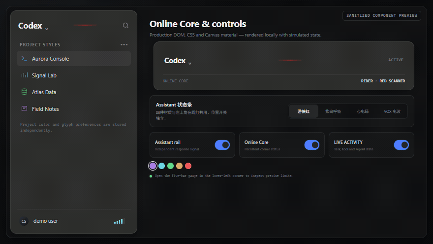
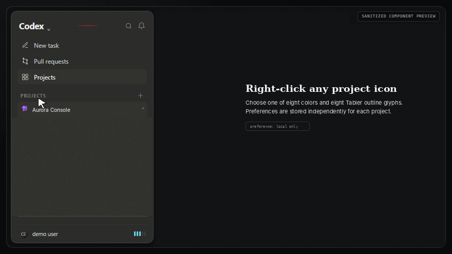

# 让你的 Codex 活起来

**Codex Surface Theme** —— 一套受 KITT 启发、会随任务状态产生反馈的 Codex 暗色界面。

> 本文件是简体中文（zh-CN）版说明；通用入口与最新状态见 [README.md](README.md)。

> 非官方社区主题（community theme）。与 OpenAI 无关，不由 OpenAI 发布、认可或维护。

Codex Surface Theme 是面向 Windows 桌面版 Codex 的本地视觉主题包，以**暗色模式**作为唯一正式视觉基线。它通过一次性 CDP 注入叠加扁平 Surface 层级与信号组件，不修改官方安装文件，也不保留独立后台进程。

## 状态

- 当前版本：`1.12.3`（见 [theme.json](theme.json)）
- 包标识：`local.codex.surface-theme`
- 注入方式：一次性 CDP 注入（`one-shot-cdp`）
- 正式支持的 Surface 颜色模式：`深色`
- 后台进程：无
- 验证基线：Codex `26.803.10989.0`；更新恢复验证：Codex `26.810.7004.0`
- 许可证：[MIT](LICENSE)

## 功能摘要

- 暗色 Surface 页面层级：中性黑色 Canvas、独立面板、小圆角、细边框和克制辉光；
- Composer 1px 彩色流光边，保留原生 `+`、模型、语音与发送控件；
- 左侧项目单列目录树与扁平线程分支；
- **右键项目图标所在行**可打开项目样式菜单：8 种颜色、8 种本地 Tabler Outline 图标，并按项目独立保存；
- Assistant 状态条四种样式：`rider`（游侠红）/ `current`（紫白呼吸）/ `ecg`（心电绿）/ `vox`（VOX 电波）；
- 左上角 Online Core、Assistant 状态条、LIVE ACTIVITY 三个独立开关；
- LIVE ACTIVITY 只显示可观察到的任务、工具与 Agent 状态，不伪造未知百分比；
- Composer Context 圆环五色快捷配色；
- 用户名旁额度仪表（`隐藏 / 状态 / 精确` 三档），只读渲染器已有查询缓存；
- 切到“原版”会撤下全部 Surface 组件；切回“Surface”恢复。浅色与跟随系统模式不属于当前 Surface 的正式适配范围。

完整使用说明见 [docs/USAGE.md](docs/USAGE.md)。

## 动态预览

以下内容是用公开样式重建的**脱敏组件演示**，不是用户桌面截图；项目名、任务名、状态和账号均为模拟数据。





两张 GIF 存放在 `docs/media/`，GitHub 仓库页面会直接展示；主题运行时不会加载它们。逐项说明见 [docs/SHOWCASE.md](docs/SHOWCASE.md)。

## 快速开始

前置条件：Windows、AppX 分发的 Codex 桌面版（包名 `OpenAI.Codex`）、Node.js 22+、PowerShell 5.1+。详见 [docs/INSTALL.md](docs/INSTALL.md)。

1. 完全退出 Codex（含托盘）。
2. 双击 `LAUNCH-CODEX-THEMED.cmd`：Launcher 定位最新安装的 Codex、分配本地调试端口并完成一次性注入。
3. 运行 `THEME-STATUS.cmd` 确认已挂载。
4. 在 Codex 外观设置中将颜色模式设为“深色”，主题选择“Surface”；需要查看官方布局时切到“原版”。
5. 需要完全移除当前窗口注入时运行 `REMOVE-THEME.cmd`。

> Codex 自动更新后若自行重启，新进程可能绕过主题入口且没有调试端口。请完全退出后再次运行 `LAUNCH-CODEX-THEMED.cmd`。详见 [docs/COMPATIBILITY.md](docs/COMPATIBILITY.md) 与 [docs/TROUBLESHOOTING.md](docs/TROUBLESHOOTING.md)。

## 标准入口

| 入口 | 用途 |
| --- | --- |
| `APPLY-THEME.cmd` | 向已开启本地调试端口的当前 Codex 一次性注入 |
| `LAUNCH-CODEX-THEMED.cmd` | 定位最新 Codex、启动并应用主题 |
| `REMOVE-THEME.cmd` | 从当前窗口移除注入，恢复官方布局 |
| `THEME-STATUS.cmd` | 只读检查挂载、开关、组件与注入器 watcher 数量 |
| `TEST-THEME-PACKAGE.cmd` | 校验文件、JSON、Node 语法、冻结基线与功能门禁 |
| `BUILD-RELEASE.cmd` | 重新生成 `SHA256SUMS.txt` 并构建 `dist/` 发布 ZIP |

## 目录结构

```text
engine/         主题运行时（CSS、注入器、配置与 SVG 资产）
qa/             本地 CDP QA/回归脚本
theme.json      版本、入口、功能与冻结基线 SHA-256
docs/           安装、使用、设计、兼容性、故障排查与安全文档
docs/media/     GitHub 页面展示的脱敏组件 GIF
SHA256SUMS.txt  全部公开文件哈希
```

## 数据与运行边界

- 仅连接本机回环地址 `127.0.0.1` 的 CDP 调试端点，不访问外部网络；
- 不调用模型、不发送提示词、不创建 Goal，因此不会额外消耗模型 Token；
- LIVE ACTIVITY、Context 与额度组件只读取渲染器已有状态或本地查询缓存；
- 注入完成后 Node 脚本退出，不保留独立 watcher、后台服务或更新守护进程。

详细说明见 [docs/SECURITY.md](docs/SECURITY.md) 与 [docs/DESIGN.md](docs/DESIGN.md)。

## 修改与维护

- 日常颜色、亮度、速度、尺寸与圆角只改 `engine/tuning.css`。
- 只有 Codex 更新导致 DOM 或状态来源变化时，才改 `engine/injector.mjs`。
- 确需改动 `engine/skin.css` 或冻结 SVG 时，必须同步更新 `theme.json` 的 SHA-256、版本号与变更记录。

详见 [CONTRIBUTING.md](CONTRIBUTING.md)。

## 第三方与许可

- Tabler Icons（MIT，© 2020–2026 Paweł Kuna）随 `engine/assets/tabler-project-icons/` 离线打包，许可证文本见该目录下 `LICENSE.txt`。
- Codex Surface Theme 采用 [MIT License](LICENSE) 发布。
- 第三方与非官方声明见 [NOTICE.md](NOTICE.md)。
